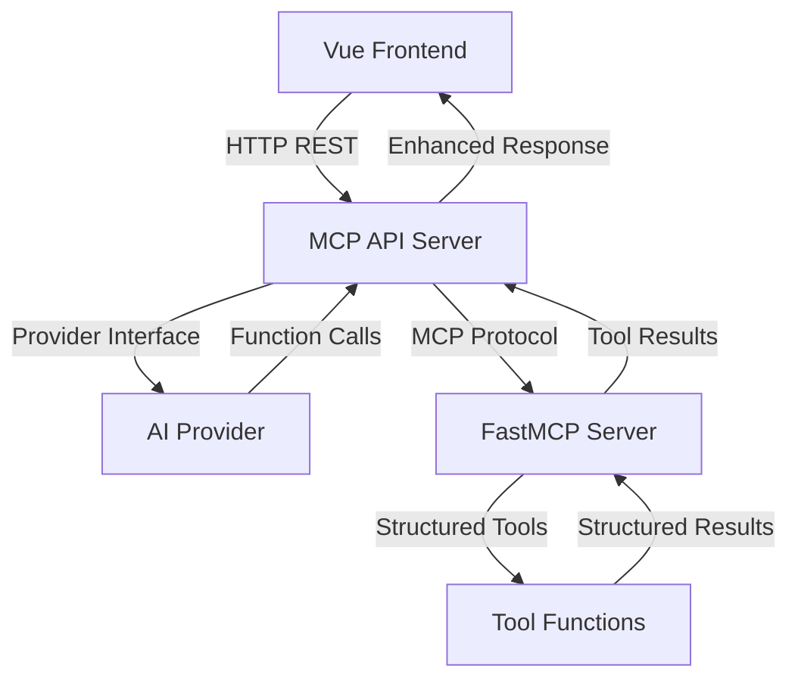

# 🏗️ Universal AI Chat - Project Structure

## 📁 **Reorganized Architecture**

Our project has been restructured into logical components with **MCP (Model
Context Protocol)** support for structured tool communication.

```
llm-experiments/
├── 🤖 ai-providers/          # AI Provider implementations
│   ├── openai_provider.py   # OpenAI GPT models
│   ├── gemini_provider.py   # Google Gemini models
│   └── claude_provider.py   # Anthropic Claude (future)
├──
├── 🧠 agent-framework/       # Core agent logic and APIs
│   ├── ai_interface.py       # Provider abstraction layer
│   ├── universal_agent.py    # Original agent (legacy)
│   ├── mcp_universal_agent.py # Enhanced MCP-enabled agent
│   ├── mcp_client.py         # MCP protocol client
│   ├── api_server.py         # Original REST API
│   ├── mcp_api_server.py     # Enhanced MCP REST API
│   └── tool_registry.py      # Legacy tool registry
├──
├── 🎨 chat-ui/               # Vue.js frontend application
│   ├── src/
│   │   ├── components/       # Vue components
│   │   ├── composables/      # Vue composables
│   │   ├── providers/        # API providers
│   │   └── themes.json       # Theme configurations
│   ├── package.json
│   └── vite.config.ts
├──
├── 🔧 mcp-server/            # FastMCP server for structured tools
│   ├── server.py             # FastMCP server implementation
│   └── requirements.txt      # MCP dependencies
├──
└── 📚 Documentation/
    ├── PROJECT_STRUCTURE.md  # This file
    ├── VUE_MIGRATION.md      # Vue migration details
    ├── THEME_SYSTEM.md       # Theme system docs
    └── test_api.md           # API testing guide
```

## 🚀 **Key Improvements**

### **🔧 MCP (Model Context Protocol) Integration**

- **Structured Tool Communication**: Tools now use Pydantic models for
  input/output validation
- **Protocol-Based**: Formal communication via JSON-RPC over stdio
- **Type Safety**: Full TypeScript-like validation for Python tools
- **Scalability**: Easy to add new tools without modifying core agent code

### **🏗️ Modular Architecture**

- **Separation of Concerns**: Each component has a clear responsibility
- **Independent Development**: Teams can work on different components
  simultaneously
- **Easy Testing**: Each module can be tested in isolation
- **Maintainability**: Clear dependencies and interfaces

## 🎯 **Component Breakdown**

### **🤖 AI Providers (`ai-providers/`)**

**Purpose**: Abstracted AI model implementations

- `openai_provider.py` - OpenAI GPT models with function calling
- `gemini_provider.py` - Google Gemini models with unified SDK
- Future: Claude, local models, custom providers

**Key Features**:

- Unified interface for all providers
- Automatic model discovery
- Structured tool calling support
- Error handling and retry logic

### **🧠 Agent Framework (`agent-framework/`)**

**Purpose**: Core intelligence and API layer

#### **Legacy Components**:

- `universal_agent.py` - Original agent implementation
- `api_server.py` - Original REST API (port 5000)
- `tool_registry.py` - Static tool definitions

#### **Enhanced MCP Components**:

- `mcp_universal_agent.py` - **NEW**: MCP-enabled agent with structured tools
- `mcp_client.py` - **NEW**: MCP protocol client
- `mcp_api_server.py` - **NEW**: Enhanced REST API (port 5001)

**Key Features**:

- Conversation memory management
- Provider switching at runtime
- Tool result context awareness
- Structured error handling

### **🔧 MCP Server (`mcp-server/`)**

**Purpose**: Structured tool execution via Model Context Protocol

**Tools Available**:

- **Math & Logic**: Calculator, random numbers, temperature conversion
- **Utilities**: Time/date, word count, text analysis
- **Web Automation**: Browser control, screenshots, navigation

**Key Features**:

- **Pydantic Models**: Type-safe input/output validation
- **Structured Results**: JSON-formatted responses with metadata
- **Error Handling**: Detailed error messages and validation
- **Protocol Compliance**: Full MCP 2024-11-05 specification

### **🎨 Chat UI (`chat-ui/`)**

**Purpose**: Modern Vue.js frontend interface

**Features**:

- **4 Beautiful Themes**: Light, Dark, System, GNOME Pink
- **Component Architecture**: Reusable Vue components
- **Reactive State**: Real-time UI updates
- **Tool Discovery**: Dynamic tool listing and configuration
- **Model Selection**: Runtime provider/model switching

## 🔄 **Data Flow**



## 🛠️ **Development Workflow**

### **Starting the Full Stack**:

1. **MCP Server** (Terminal 1):

```bash
cd mcp-server
source ../venv/bin/activate
python server.py
```

2. **Enhanced API Server** (Terminal 2):

```bash
cd agent-framework
source ../venv/bin/activate
python mcp_api_server.py  # Port 5001
```

3. **Vue Frontend** (Terminal 3):

```bash
cd chat-ui
npm run dev  # Port 5173
```

### **Development Ports**:

- **Frontend**: http://localhost:5173
- **Enhanced API**: http://localhost:5001 (MCP-enabled)
- **Legacy API**: http://localhost:5000 (original)
- **MCP Server**: stdio (internal communication)

## 🧪 **Testing the System**

### **Health Check**:

```bash
curl http://localhost:5001/health | jq
```

### **Available Tools**:

```bash
curl http://localhost:5001/tools | jq
```

### **Enhanced Chat**:

```bash
curl -X POST http://localhost:5001/chat/simple \
  -H "Content-Type: application/json" \
  -d '{"message": "Calculate 15 * 23 + 7 and tell me the current time", "use_tools": true}' | jq
```

## 🎯 **Migration Benefits**

### **For Users**:

- **Better Responses**: Structured tools provide more accurate, detailed results
- **Real-time Updates**: Vue frontend with reactive state
- **Theme Customization**: 4 beautiful themes with easy extensibility
- **Tool Transparency**: See exactly which tools are being used

### **For Developers**:

- **Type Safety**: Pydantic models prevent runtime errors
- **Easy Tool Addition**: Just add to MCP server, no agent code changes
- **Modular Development**: Work on components independently
- **Better Testing**: Each component can be tested in isolation
- **Clear APIs**: Well-defined interfaces between components

### **For Operations**:

- **Better Logging**: Structured logs with request tracing
- **Health Monitoring**: Comprehensive health checks
- **Error Handling**: Graceful degradation and detailed error messages
- **Scalability**: Components can be deployed independently

## 🔮 **Future Enhancements**

### **Short Term**:

- [ ] **Claude Provider**: Add Anthropic Claude support
- [ ] **Tool Categories**: Enhanced tool organization
- [ ] **Conversation Export**: Save/load conversations
- [ ] **Tool Marketplace**: Community-contributed tools

### **Medium Term**:

- [ ] **Multi-Agent**: Multiple agents with different specializations
- [ ] **Tool Chaining**: Automatic tool workflow creation
- [ ] **Custom Models**: Support for local/custom models
- [ ] **WebSocket API**: Real-time streaming responses

### **Long Term**:

- [ ] **Agent Marketplace**: Community-contributed agents
- [ ] **Workflow Builder**: Visual tool chaining interface
- [ ] **Enterprise Features**: SSO, audit logs, compliance
- [ ] **Mobile App**: Native mobile interface

## 📋 **Next Steps**

1. **Test the MCP System**: Verify all components work together
2. **Update Frontend**: Point to new MCP API endpoint (port 5001)
3. **Add More Tools**: Extend MCP server with additional capabilities
4. **Performance Optimization**: Profile and optimize the MCP communication
5. **Documentation**: Create detailed API documentation

---

**🎉 The Universal AI Chat system is now powered by MCP for structured,
reliable, and extensible tool communication!**
